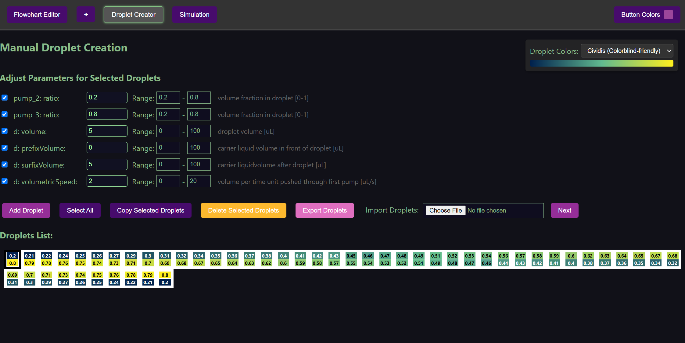
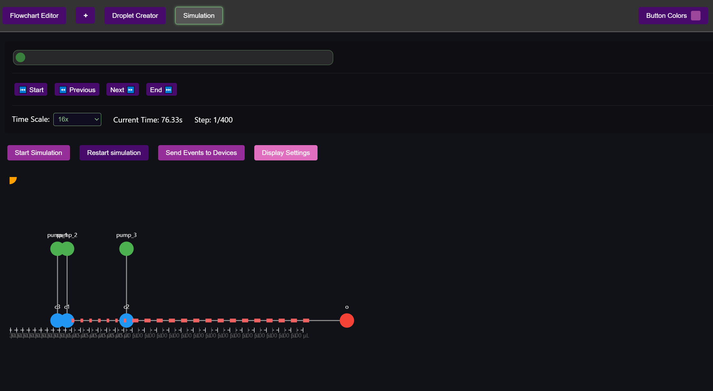

# FluidicGUI

FluidicGUI is a web-based graphical user interface for designing, controlling, and simulating microfluidic flow chemistry experiments. It provides an intuitive interface for creating droplet sequences, managing flow parameters, and communicating with microfluidic hardware via MQTT.





## Overview

This project enables chemists and researchers to:
- Design microfluidic flow chemistry experiments visually
- Generate and manage droplet sequences with precise parameters
- Control hardware devices through MQTT communication
- Simulate and visualize experimental outcomes

## Quick Start

```bash
# Clone the repository
git clone https://github.com/yourusername/fluidicgui.git
cd fluidicgui

# Install dependencies
npm install
cd frontend/fluidicgui
npm install
cd ../../backend
npm install
cd ..

# Start the application (both frontend and backend)
npm start
```

Visit [http://localhost:3000](http://localhost:3000) to access the application.

## Documentation

For detailed documentation, see:
- [Frontend Documentation](frontend/fluidicgui/README.md)
- [API Documentation](docs/API.md) <!-- Create this file if needed -->
- [Hardware Integration Guide](docs/hardware-integration.md) <!-- Create this file if needed -->

## Project Structure

```
fluidicgui/
├── backend/               # Node.js backend server
│   ├── server.js          # WebSocket and MQTT bridge
│   └── package.json       # Backend dependencies
├── frontend/
│   └── fluidicgui/        # React frontend application
│       ├── public/        # Static assets
│       ├── src/           # React source code
│       │   ├── components/# React components
│       │   ├── context/   # React context providers
│       │   ├── styles/    # CSS and styling
│       │   └── utils/     # Utility functions
│       └── package.json   # Frontend dependencies
└── package.json           # Root package.json for running both services
```

## License

This project is licensed under the MIT License - see the [LICENSE](LICENSE) file for details.

## Contributing

Contributions are welcome! Please see our [Contributing Guide](CONTRIBUTING.md) for more details. 
